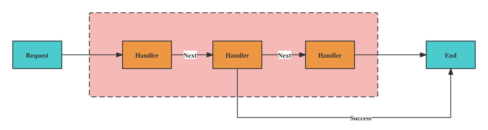
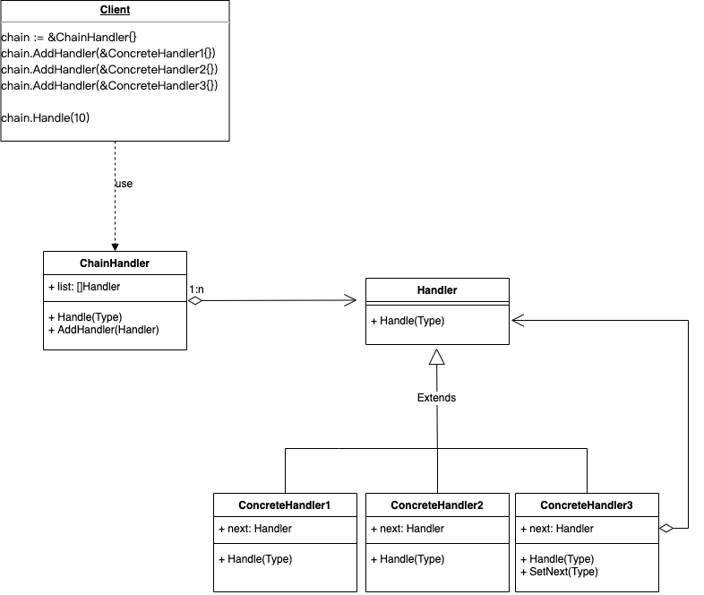
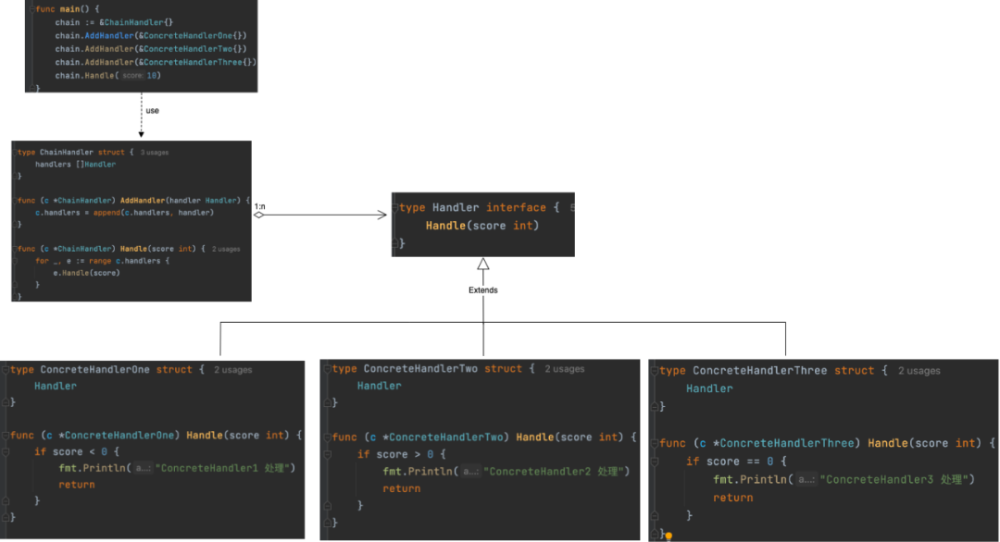

责任链模式是我们工作中经常遇到的模式，特别是web后端工程师，我们工作中每时每刻都在用：因为市面上大部分的web框架的过滤器基本都是基于这个设计模式为基本模式搭建的。


## 模式介绍

先看一下责任链模式（Chain Of Responsibility Design Pattern）的英文介绍：Avoid couping the sender of a request to its receiver by giving more than one object to handle the request. Chain th receiving objects and pass the request along the chain until an object handles it.

翻译成中文就是：将请求的发送和接收解耦，让多个接收对象都有机会处理这个请求。将这些接收对象串成一条链，并沿着这条链传递这个请求，直到链上的某个接收对象能够处理它为止。

这么说比较抽象，用更加容易理解的话来进一步解读一下。在责任链模式中，一个请求过来，会有多个处理器（也就是刚刚定义中说的“接收对象”）依次处理同一个请求。即请求先经过A处理器处理，然后再把请求传递给B处理器，B处理器处理完后再传递给C处理器，以此类推，形成一个链条。链条上的每个处理器各自承担各自的处理职责，所以叫作责任链模式。




## UML



`ChainHandler`结构体用来管理拼接的`Handler`，client端无需了解`Handler`的业务，`Handler`的组合可以使用链表，也可以使用数组，具体实现如下：

先定义`Handler`接口：

```go
type Handler interface {
  Handler(score int)  
}
```

然后分别实现Handler接口的三个结构体：`ConcreteHandlerOne`

```go
type ConcreteHandlerOne struct {
  Handler
}
func (c *ConcreteHandlerOne) Handle(score int) {
  if score < 0 {
    fmt.Println("ConcreteHandlerOne 处理")
    return
  }
}
```

`ConcreteHandlerTwo`结构体的实现

```go
type ConcreteHandlerTwo struct {
  Handler
}
func (c *ConcreteHandlerTwo) Handle(score int) {
  if score > 0 {
    fmt.Println("ConcreteHandlerTwo 处理")
    return
  }
}
```

`ConcreteHandlerThree`结构体的实现

```go
type ConcreteHandlerThree struct {
  Handler
}
func (c *ConcreteHandlerThree) Handle(score int) {
  if score == 0 {
    fmt.Println("ConcreteHandlerThree 处理")
    return
  }
}
```

`main`函数调用（client调用）：

```
func main() {
	chain := &ChainHandler{}
	chain.AddHandler(&ConcreteHandlerOne{})
	chain.AddHandler(&ConcreteHandlerTwo{})
	chain.AddHandler(&ConcreteHandlerThree{})
	chain.Handle(10)
}
```

最终实现的结构图：




日常工作中出现的责任链模式（Chain Of Responsibility Design Pattern）一般都是以上这种包含`Handler`管理的模式。


## 总结

责任链模式的基本思想就是要处理的请求（通常会是结构体，然后作为函数参数），依次经过多个处理对象的处理，这里处理函数可以动态的添加和删除，具备很高的灵活性和扩展性，通常会对这些处理函数做统一处理，存储方式一般是通过链表，数组，hash map等存储结构。

责任链模式的应用非常广泛：

1. 业务场景：作为敏感词（涉黄，政治，反动等）过滤的设计结构。
2. 技术框架：路由，router过滤器，日志log框架等等。


## 参考

1. https://mp.weixin.qq.com/s/BW8buklwMCi_0M6AK0H0iA


