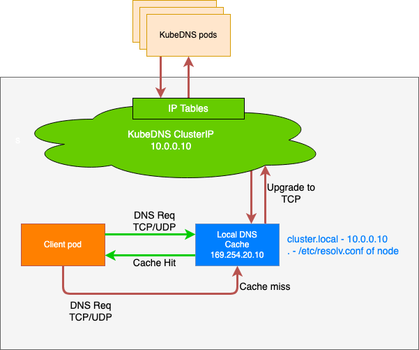

## CoreDNS性能优化
### 简介
由于 CoreDNS 在整个集群中属于比较重要的插件，承担的服务发现的任务，所以容器集群对其性能要求比较高。

```
/app # cat /etc/resolv.conf
search default.svc.cluster.local svc.cluster.local cluster.local
nameserver 10.254.0.10
options ndots:5
```
Kubernetes Pod 解析 DNS 域名会 search 很多次，例如上图 Pod 的 DNS 配置，当它请求 www.baidu.com， 会依次解析：
- www.baidu.com.default.svc.cluster.local -> NXDOMAIN
- www.baidu.com.svc.cluster.local -> NXDOMAIN
- www.baidu.com.cluster.local -> NXDOMAIN
- www.baidu.com -> 110.242.68.4

CoreDNS 是中心化部署在某一个节点上，Pod 访问 CoreDNS 解析经过链路过长，又是 UDP 协议，导致失败率高。

当前社区有以下几种方式用于 CoreDNS 性能优化：
1. 启用 CoreDNS 自动扩缩容。 
2. 关闭 IPV6 解析。 
3. 合理配置 ndots。 
4. 启用 Autopath。 
5. 部署 NodeLocal DNSCache。 
6. 配置拓扑感知（就近访问原则）

### （一）启用CoreDNS自动扩缩容
安装 [cluster-proportional-autoscaler](https://github.com/kubernetes-sigs/cluster-proportional-autoscaler) 以实现更精确的扩缩容

### （二）关闭IPV6解析
如果 K8S 节点没有禁用`IPV6`的话，容器内进程请求 coredns 的默认行为是同时发起`IPV4`和`IPV6`解析，
而通常我们只需要用到`IPV4`，当容器请求某个域名时，coredns 解析不到`IPV6`记录，就会 forward 到 upstream 去解析，
如果到 upstream 需要经过较长时间(比如跨公网，跨机房专线)，就会拖慢整个解析流程的速度，
业务层面就会感知 DNS 解析慢。

CoreDNS 有一个 template 的插件，可以用它来禁用`IPV6`的解析，只需要给 CoreDNS 加上如下的配置:
```
template ANY AAAA {
    rcode NXDOMAIN
}
```
>这个配置的含义是：给所有`IPV6`的解析请求都响应空记录，即无此域名的`IPV6`记录。

### （三）合理配置ndots
默认情况下，Kubernetes 集群中的域名解析往往需要经过多次请求才能解析到。查看 pod 内 的`/etc/resolv.conf`可以知道`ndots`选项默认为 5:
```
/app # cat /etc/resolv.conf
search default.svc.cluster.local svc.cluster.local cluster.local
nameserver 10.254.0.10
options ndots:5
```
上文的配置的意思是：如果域名中`.`的数量小于5，就依次遍历`search`中的后缀并拼接上进行 DNS 查询。

| ndots 数量 | 动作                                    |
|----------|---------------------------------------|
| <5       | 先走 search 域，最后将其视为绝对域名进行查询            |
| >=5      | 直接视为绝对域名进行查找，只有当查询不到的时候，才继续走 search 域 |

例如：在某个 pod 中查询`kubernetes.default.svc.cluster.local` 这个 service:
1. 域名中有4个`.`，小于5，尝试拼接上第一个`search`进行查询，即`kubernetes.default.svc.cluster.local.default.svc.cluster.local`,
查不到该域名。
2. 继续尝试`kubernetes.default.svc.cluster.local.svc.cluster.local`，查不到该域名。
3. 继续尝试`kubernetes.default.svc.cluster.local.cluster.local`，仍然查不到该域名。
4. 尝试不加后缀，即`kubernetes.default.svc.cluster.local`，查询成功，返回响应的 ClusterIP。

可以看到一个简单的 service 域名解析需要经过4轮解析才能成功，集群中充斥着大量无用的 DNS 请求。

可以尝试着在 Pod 的 dnsConfig 中设置`ndots`为2，然后业务发请求时尽量将 service 域名拼完整，
这样就不会经过 search 拼接造成大量多余的 DNS 请求。

### （四）启用AutoPath
启用 CoreDNS 的 autopath 插件可以避免每次域名解析经过多次请求才能解析到，原理是 CoreDNS 智能识别拼接过 search 的 DNS 解析，
直接响应 CNAME 并附上相应的 ClusterIP，一步到位，可以极大减少集群内 DNS 请求数量。
```
cluster.local {
    autopath @kubernetes
    kubernetes {
        pods verified
    }
}
```
> 需要注意的是，启用 autopath 后，由于 coredns 需要 watch 所有的 pod，会增加 coredns 的内存消耗，
> 根据情况适当调节 coredns 的 memory request 和 limit。

[如何开启 autopath](https://github.com/coredns/coredns/tree/master/plugin/kubernetes#autopath)

### （五）部署NodeLocal DNSCache


直接参考官方文档 [Using NodeLocal DNSCache in Kubernetes clusters](https://kubernetes.io/docs/tasks/administer-cluster/nodelocaldns/)

### （六）配置拓扑感知（就近访问原则）
通过配置服务拓扑感知路由使 pod 的 DNS 请求可以落入同一个 AZ 的 coreDNS 服务器上。

[Topology-aware traffic routing with topology keys](https://kubernetes.io/docs/concepts/services-networking/service-topology/)

### TODD 按照上述优化后，DNS 性能提升了多少？？

### 参考文献
1. https://imroc.cc/k8s/best-practice/optimize-dns/
2. https://support.huaweicloud.com/usermanual-cce/cce_01_0133.html
3. https://aws.amazon.com/cn/blogs/china/how-to-optimize-amazon-eks-cluster-dns-performance/
4. https://qingwave.github.io/k8s-dns-optimize/
5. https://www.1nth.com/post/k8s-coredns/
6. https://help.aliyun.com/document_detail/172339.html
7. https://www.modb.pro/db/137767
8. https://zhuanlan.zhihu.com/p/474131897