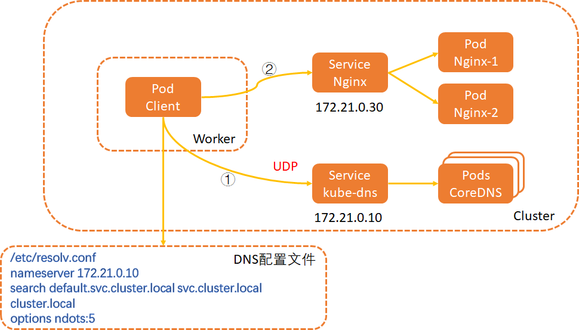

## DNS概述
DNS 为 Kubernetes 集群内的工作负载提供域名解析服务。本文主要介绍 Kubernetes 集群中 DNS 域名解析原理和 CoreDNS。


## Kubernetes 集群中 DNS 域名解析原理
容器集群中`kubelet`的启动参数有`--cluster-dns=<dns-service-ip>`和`--cluster-domain=<default-local-domain>`，
这两个参数分别被用来设置集群 DNS 服务器的 IP 地址和主域名后缀。

容器集群一般会部署一套 CoreDNS 工作负载，并通过`kube-dns`的服务名暴露 DNS 服务。集群会根据 Pod 内的配置，
将域名请求发往集群 DNS 服务器获取结果。Pod 内的 DNS 域名解析配置文件为`/etc/resolv.conf`，文件内容如下：
```shell
nameserver 172.xx.x.xx
search kube-system.svc.cluster.local svc.cluster.local cluster.local
options ndots:5
```
文件内容说明：

| 参数         | 描述                                                                                                                                                              |
|------------|-----------------------------------------------------------------------------------------------------------------------------------------------------------------|
| nameserver | 定义 DNS 服务器的 IP 地址。                                                                                                                                              |
| search     | 设置域名的查询后缀规则，查找配置越多，说明域名解析查找匹配次数越多。容器集群匹配有`kube-system.svc.cluster.local`、`svc.cluster.local`、`cluster.local`3个后缀，最多进行8次查询才能得到正确解析结果，因为就请你里面进行 IPV4 和 IPV6 查询各四次 |
| options    | 定义域名解析配置文件选项，支持多个 KV 值，例如该参数设置成`ndots:5`，说明如果访问的域名字符串内的点字符数量超过`ndots`值，则认为是完整域名，并被直接解析；如果不足`ndots`值，则追加`search`段后缀再进行查询。                                        |


DNS 解析原理示例图


| 序号  | 描述                                                                                                                                                                |
|-----|-------------------------------------------------------------------------------------------------------------------------------------------------------------------|
| ①   | 业务Pod（Pod Client）试图访问Nginx服务（Service Nginx）时，先会请求本地DNS配置文件（/etc/resolv.conf）中指向的DNS服务器（nameserver 172.21.0.10，即Service kube-dns）获取服务IP地址，得到解析结果为172.21.0.30的IP地址。 |
| ②   | 业务Pod（Pod Client）再直接发起往该IP地址的请求，请求最终经过Nginx服务（Service Nginx）转发到达后端的Nginx容器（Pod Nginx-1和Pod Nginx-2）上。                                                             |


## 集群 dnsPolicy 配置说明
容器集群支持通过 dnsPolicy 字段为每个 Pod 配置不同的 DNS 策略。目前容器集群支持四种策略：
- ClusterFirst：通过 CoreDNS 来做域名解析，Pod 内`/etc/resolv.conf`配置的 DNS 服务地址是集群 DNS 服务的 kube-dns 地址。
该策略是集群工作负载的默认策略。
- None：忽略集群 DNS 策略，需要您提供 dnsConfig 字段来指定 DNS 配置信息。
- Default：Pod 直接继承集群节点的域名解析配置。即在容器集群直接使用节点`/etc/resolv.conf`文件（文件内配置的是云厂商 DNS 服务）。
- ClusterFirstWithHostNet：强制在 hostNetWork 网络模式下使用 ClusterFirst 策略（默认使用Default策略）。

## DNS 解析级缓存策略说明
介绍 Kubernetes 集群中容器 Pod 在域名解析过程中的解析策略和缓存策略。
- https://help.aliyun.com/document_detail/414219.html

## DNS 最佳实践和解析异常问题排查
- https://help.aliyun.com/document_detail/172339.html
- https://help.aliyun.com/document_detail/404754.html
- 
## 参考文献
1.https://support.huaweicloud.com/intl/zh-cn/dns/index.html
2.https://intl.cloud.tencent.com/zh/document/product/457/39125