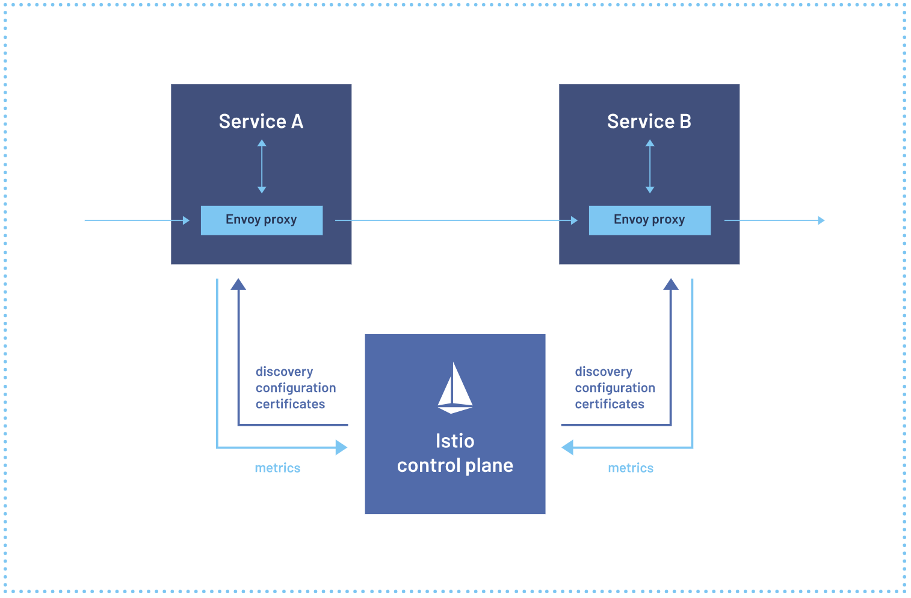

## 服务网格 Istio
Istio 通过分布式或者微服务体系架构对开发人员和运维人员提出了挑战，无论客户是从头构建还是将现有应用程序迁移到云本地，Istio 都可以提供帮助。

通过添加一个代理`sidecar`到部署的每个应用程序旁边，Istio 可以让用户在网络中对应用程序感知的流量管理，令人难以置信的可观察性和强壮的安全功能进行编程管理。

## 服务网格是什么？
现代应用程序通常被构建为微服务的分布式集合，每个微服务集合都执行一些离散的业务功能。服务网格是一个专用的基础架构层，可以将其添加到应用程序中。服务网格允许用户透明地添加可观察性，
流量管理和安全等功能，而无需将它们添加到用户自己的代码中。`service mesh`一词既描述了用户用于实现此模式的软件类型，也描述了使用该软件时创建的安全性和网络域。

随着分布式服务的部署（例如基于 Kubernetes 的系统）的大小和复杂性的增长，它可能变得更难理解和管理。它的要求包括服务发现，负载均衡，故障恢复，指标和监控。
服务网格通常还解决了更复杂的操作要求，例如 A/B 测试，金丝雀部署，限流，访问控制，加密和端到端的身份验证。

服务到服务通信是使分布式应用程序成为可能的原因。随着服务数量的增长，在应用程序集群内外，将这种通信路由变得越来越复杂。 Istio 有助于降低这种复杂性，同时减轻开发团队的压力。

## Istio 是什么？
Istio 是开源的服务网格，它透明地分层到现有的分布式程序上。Istio 的强大特性提供了一种统一且有效的方式来保护，连接和监视服务。Istio 是实现负载均衡，
服务到服务的身份验证和监控的路径 - 只需要很少或不需要更改服务代码。其强大的控制面板带来了以下重要特点：
- 通过 TLS 加密，强大的基于身份的认证和授权对集群内的服务之前的通信进行安全管理。
- HTTP，gRPC，WebSocket，TCP 流量自动负载均衡。
- 使用丰富的路由规则，重试，故障转移和故障注入对流量行为进行细粒度控制。
- 可插入策略层和配置 API支持访问控制，速率限制和配额限制等功能。
- 集群内所有流量的 metrics，logs 和 traces 的自动采集，包括集群的入口流量和出口流量。

Istio 是为扩展性而设计的，可以处理各种不同的部署需求。Istio 的控制面板运行在 Kubernetes 上，可以将部署在集群中的应用程序添加到服务网格中，或者可以将服务网格扩展到其他集群，
甚至连接运行在 Kubernetes 之外的虚拟机或其他端点。

一个由贡献者，合作伙伴，集成和分销商组成的大型生态系统为各种场景扩展和利用 Istio。客户可以自己安装 Istio，或者许多供应商都有集成 Istio 并为用户管理它的产品。

## Istio 如何工作？
Istio 有两个组件：数据面板和控制面板

数据面板是服务之间的通信。没有服务网格，网络将不了解发送的流量，也无法根据其是那种类型的流量或来自谁的流量做出任何决定。

服务网格使用代理来拦截用户所有的流量，从而允许基于用户设置的配置来驱动一系列的应用程序感知功能。

Envoy 代理与集群中的每个服务一起部署，或者与 VM 上运行的服务一起运行。

控制面板采用客户所期望的配置以及对服务的视图，并动态编程代理服务器，当规则和环境改变时同步更新代理服务器。

【使用 Istio 之前】

【使用 Istio 之后】

## Istio 概念点
### 流量管理
在单个集群内和跨集群的路由流量都会影响性能，并支持更好的部署策略。Istio 的流量路由规则允许用户轻松地控制服务之间的流量和 API 调用。Istio 简化了服务级的属性配置，
如熔断器，超时和重试，并简化了其他重要的特性，比如 A/B 测试，金丝雀发布和基于流量百分比的流量切割策略。

### 可观测性
随着服务复杂性的增长，理解行为和性能变得越来越具有挑战性。Istio 为服务网格内的所有通信生成详细的遥测。这种遥测技术提供了服务行为的可观察性，使操作人员能够排除故障、维护和优化他们的应用程序。
更好的是，几乎不需要更改应用程序就可以获得所有这些插装。通过 Istio，运维人员可以全面了解被监控服务的交互方式。

Istio 的遥测技术包括详细的指标、分布式跟踪和完整的访问日志。通过 Istio，您可以获得全面全面的服务网格可观察性。

### 安全功能
微服务有特殊的安全需求，包括防止中间人攻击，灵活的访问控制，审计工具和 mTLS。Istio 包括一种综合安全解决方案，可以让运维人员解决所有这些问题。
提供了强大的身份，强大的策略，透明的 TLS 加密以及身份认证，授权和审计（AAA）工具来保护服务和数据的安全。

Istio 的安全模型基于默认安全性，目的是提供深入的防御，以使用户即使在不信任的网络之间也可以部署安全的应用程序。

## 参考链接
- https://istio.io/latest/about/service-mesh/